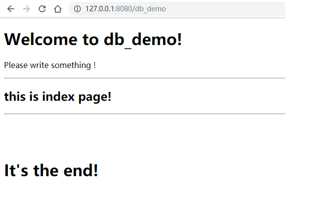
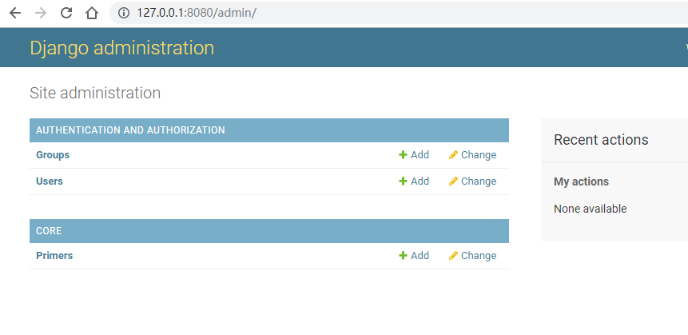
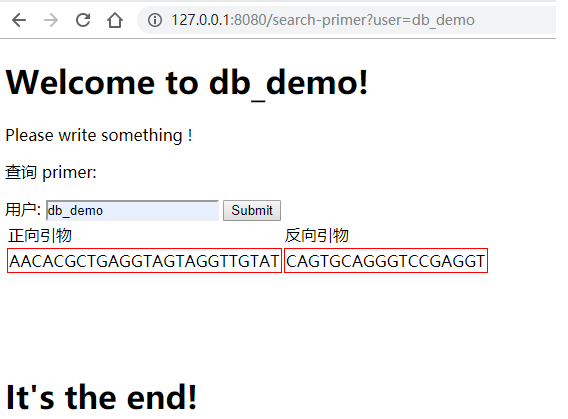
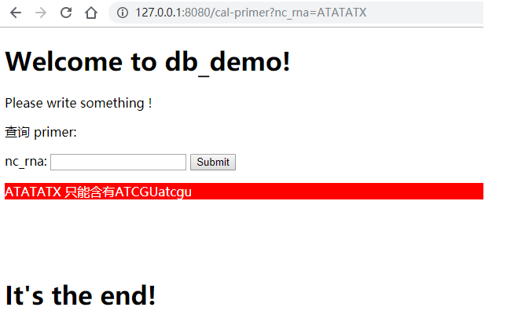
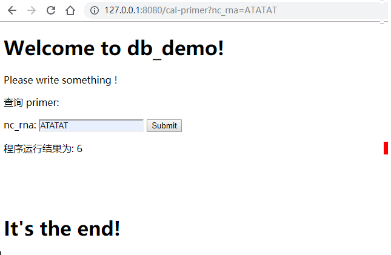
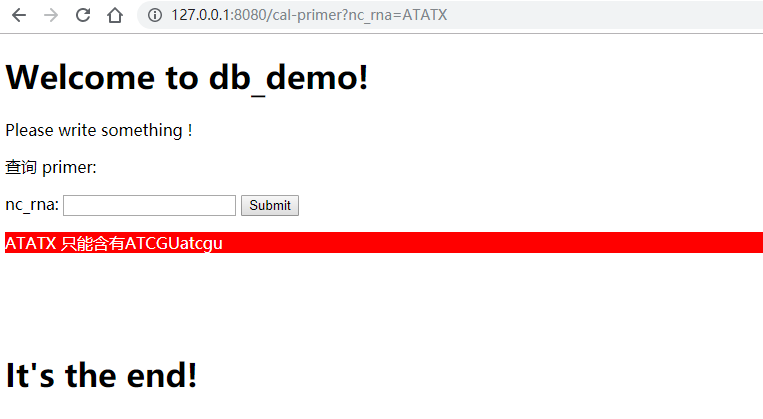

# db_demo

> this is a demo about database.


## quick start

* step 1:
```angularjs
git clone git@github.com:qzhqzh/db_demo.git
cd db_demo
pip install -r requirement.txt
cp db_demo/env.bak.py db_demo/env.py
```

* step 2:
安装 postgresSQL 数据库，并依次执行文档中的 创建用户和数据库 操作

* step 3:
```angularjs
python manage.py makemigrations
python manage.py migrate
python manage.py runserver 0.0.0.0:8080
```

* step 4:
首页：127.0.0.1:8080/db_demo
后台：127.0.0.1:8080/admin
接口：127.0.0.1:8080/core/primer
检索：127.0.0.1:8080/search-primer
计算：127.0.0.1:8080/cal-primer

* step 5
进入接口页面，录入一条引物即可检索


## 设置

<span id="jump">postgresSQL</span>

### 数据库选择
默认数据库为 sqlite3，修改数据库为 postgresSQL数据库示例
`db_demo\setting.py`
```
# Database
# https://docs.djangoproject.com/en/2.1/ref/settings/#databases

DATABASES = {
    'default': {
        'ENGINE': 'django.db.backends.sqlite3',
        'NAME': os.path.join(BASE_DIR, 'db.sqlite3'),
    }
}
```
修改为
```angular2html
DATABASES = {
    'default': {
        'NAME': envs.DATABASE_NAME,
        'ENGINE': 'django.db.backends.postgresql',
        'USER': envs.DATABASE_USER,
        'PASSWORD': envs.DATABASE_PASSWORD,
        'HOST': envs.DATABASE_HOST if envs.DATABASE_HOST else '127.0.0.1',
        'PORT': envs.DATABASE_PORT if envs.DATABASE_PORT else '5432',
        'ATOMIC_REQUESTS': True,
    }
}
```

登录数据库: `psql -Upostgres`

查看当前存在用户: `select * from pg_user;`

创建新用户: `create user db_demo with password 'db_demo';`

创建新数据库: `create database db_demo owner db_demo;`

授权新数据库权限: `grant all privileges on database db_demo to db_demo;`


测试连接: `python manage.py dbshell`
migration: `python manage.py makemigrations`
migrate: `python manage.py migrate`
创建管理员: `python manage.py createsuperuser`
登录后台查看: 例如 [127.0.0.1:8080/admin ](127.0.0.1:8080/admin)

---

## app
相关的逻辑可以放到一个app中

```angular2html
django-admin startapp core
```
新增的 app name 需要加入到 setting 的 INSTALLED_APPS 中才能被发现
 
示例中，使用了 Primer 这个模型为例子，其中 User 模型使用 django 内置模型

任何对数据库增删表，以及表结构变化，都需要进行以下操作
```angular2html
python manage.py makemigrations
python manage.py migrate
```
这里增加了一个 Primer 模型，所以需要运行以上命令，`makemigrations`会生成相应的数据库更改语句，可以进入对应文件查看

为了访问到 Primer 模型的数据，我们需要设置相关路由
为了方便使用，添加 [rest_framework](https://www.django-rest-framework.org/)
'rest_framework' 需要加入到 setting 的 INSTALLED_APPS 中才能被发现

增加到 admin 视图中，vim core/admin.py
```angularjs
@admin.register(Primer)
class GeneAdmin(admin.ModelAdmin):
    list_display = ('id', 'fp', 'rp', 'submitter')
```


vim core/urls.py
```angularjs
from rest_framework import routers
from core.views import *

routers = routers.SimpleRouter(trailing_slash=False)

routers.register('sample', PrimerViewSet)

urlpatterns = routers.urls
```

以及对应的视图

vim core/viewss.py
```angularjs
from core.models import Primer
from core.serializers import PrimerSerializer
from rest_framework.viewsets import ViewSet

# Create your views here.

class PrimerViewSet(ViewSet):
    queryset = Primer.objects.all()
    serializer_class = PrimerSerializer
```

以及对应的序列化
```angularjs
from rest_framework.serializers import ModelSerializer
from core.models import Primer

class PrimerSerializer(ModelSerializer):
    class Meta:
        model = Primer
        fields = '__all__'
```

至此，一个 Primer 模型可以被正常使用。

接口访问方式: `http://127.0.0.1:8080/core/primer`

测试提交

前向引物`AACACGCTGAGGTAGTAGGTTGTAT`
反向引物`CAGTGCAGGGTCCGAGGT`
提交人`db_demo`

测试获取引物
curl http://127.0.0.1:8080/core/primer
返回结果 
[{"id":1,"fp":"AACACGCTGAGGTAGTAGGTTGTAT","rp":"CAGTGCAGGGTCCGAGGT","submitter":1}]

分页方法
在 setting 中增加
```angularjs
# rest_framework setting
REST_FRAMEWORK = {
    'DEFAULT_PAGINATION_CLASS': 'rest_framework.pagination.PageNumberPagination',
    'PAGE_SIZE': 20,
    'DEFAULT_FILTER_BACKENDS': (
        'rest_framework.filters.SearchFilter',
        'django_filters.rest_framework.DjangoFilterBackend',)
}
```
再次测试结果为
{"count":1,"next":null,"previous":null,"results":[{"id":1,"fp":"AACACGCTGAGGTAGTAGGTTGTAT","rp":"CAGTGCAGGGTCCGAGGT","submitter":1}]}

## template
以上数据可以完成配合前端使用。
如果希望利用 django 的模板，可以根据以下教程

db_demo/setting 中设置模板目录: `'DIRS': [os.path.join(BASE_DIR, 'templates')],`

1. 静态页面
* 设置url
vim db_demo/views.py
```angularjs
def db_demo(request):
    return render(request, index.html)
```
新建 templates/layout.html 文件，编写页面内容
新建 templates/index.html 文件，编写页面内容

index页面可以继承 layout 页面的主体框架，以至于导航栏和底部样式不用复写

2. 变量传递
查询一个用户的所有primer的功能

新建 templates/search-primer.html 文件，编写页面内容
新建 templates/search-primer-result.html 文件，编写页面内容

通过 content 传递查询参数，并根据是否存在查询参数返回不同页面

3. 运行命令

新建 templates/cal-primer.html 文件，编写页面内容
新建 templates/cal-primer-result.html 文件，编写页面内容


## 部分测试截图

生成环境可以设置 db_demo/setting.py 中 DEBUG = false

首页


后台管理页面


检索引物成功


检索引物失败


计算引物成功


计算引物失败



## todo

1. 后台执行计算程序不能短时间完成。思路：生成任务id，记录pid和结果文件，定时查询pid，当pid不存在的时候，更新任务状态为完成，用户通过任务id来查询任务状态以及结果。
2. 使用 apache 代理，配置相应日志系统
3. 构建 docker 镜像，通过 docker 方式部署
4. 增加批量向数据库中存入引物数据命令